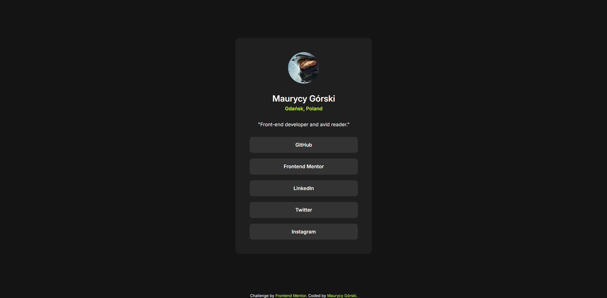

# Frontend Mentor - Social links profile solution

This is a solution to the [Social links profile challenge on Frontend Mentor](https://www.frontendmentor.io/challenges/social-links-profile-UG32l9m6dQ). Frontend Mentor challenges help you improve your coding skills by building realistic projects. 

## Table of contents

- [Overview](#overview)
  - [The challenge](#the-challenge)
  - [Screenshot](#screenshot)
  - [Links](#links)
- [My process](#my-process)
  - [Built with](#built-with)
  - [What I learned](#what-i-learned)
  - [Useful resources](#useful-resources)
- [Author](#author)


## Overview

### The challenge

Users should be able to:

- See hover and focus states for all interactive elements on the page

### Screenshot



### Links

- Solution URL: []
- Live Site URL: [https://jvk321.github.io/Social_links_profile/]

## My process

### Built with

- Semantic HTML5 markup
- CSS custom properties
- Flexbox
- Mobile-first workflow
- media querys

### What I learned

I learned how to make a website responsive by using media querys and learned how to use max-width, min-width, width. 

```css
.info {
    width: 100%;
    height: 100%;
    max-width: 327px;
    max-height: 579px;
    background-color: #1F1F1F;
    border-radius: 12px;
    padding: 24px;
    display: flex;
    flex-direction: column;
    align-items: center;
    gap: 24px;
}
```
```css
/* TABLET + DESKTOP */
@media (min-width: 768px) {
    .info {
        max-width: 384px;
        max-height: 611px;
        padding: 40px;
    }
}
```

### Useful resources

- [https://developer.mozilla.org/en-US/docs/Web/CSS/Guides/Media_queries/Using] - This helped me to make the site responsive. 

## Author

- Frontend Mentor - [@Jvk321](https://www.frontendmentor.io/profile/Jvk321)
